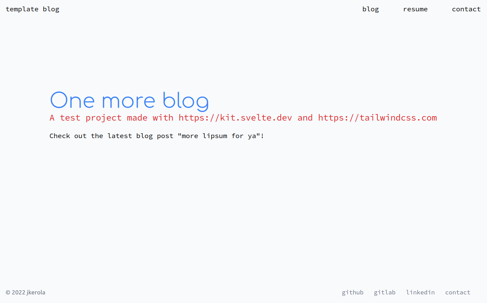
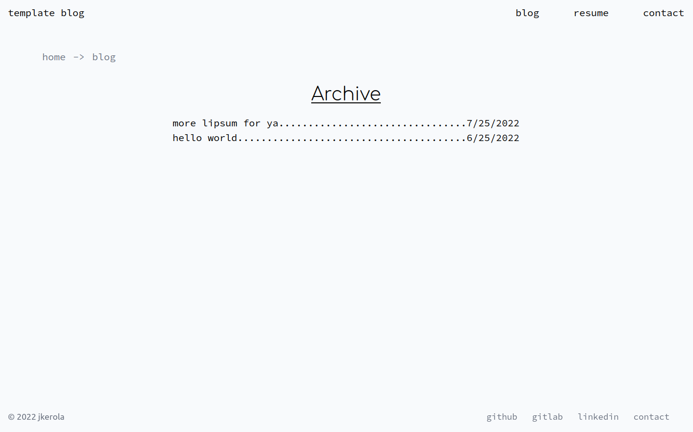
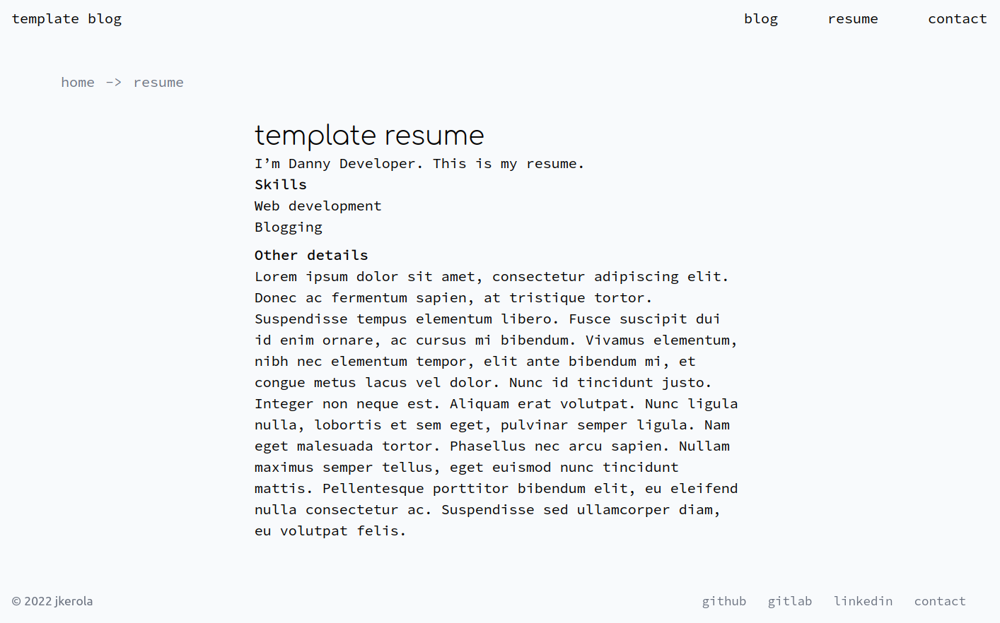

# minimalist blog made with svelte





A quick project to learn svelte.

## Development

Run these to start local development:

```shell
npm install
npm run dev
```

This project uses [pre-commit](https://pre-commit.com) hooks. Install them with:

```shell
python3 pip install pre-commit
pre-commit install
```

## Customizing the template

To create a quick homepage/blog for yourself:

- Modify _src/routes/index.svelte_ to customize the frontpage
- Modify _src/blog.config.js_ with your social media links
- Modify _src/routes/contact/contact.md_ with your contact details
- Modify _src/routes/resume/resume.md_ with your resume details
- Add/remove blog posts under the _src/routes/blog_ directory

Then build the project with

```shell
npm run build
```

and host it wherever you wish.
